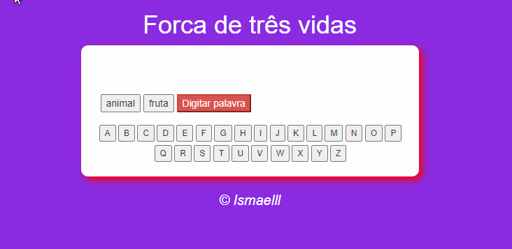

# Jogo_Forca
>Status: Projeto Completo

;
## Desenvolvimento
Esse projeto imita um jogo da forca simples, nele temos as opções padrões de temas, animal e fruta, e temos também a oportunidade do próprio usuário escolher sua palavra, reformatando se a escolhida houver acento. Nele eu utilizei bastante funções, arrays e laços de repetição for.
>Nesse projeto eu pude conhecer a propriedade "children".
## Linguagens usadas
+ JavaScript
+ Html
+ Css
## Sobre mim
Me chamo Ismael Mateus de Souza, tenho 18 anos (2021), estou cursando Ciências da Computação. Sou extremamente iniciante na área ainda, mas estou bem empolgado pelo que há de vir.